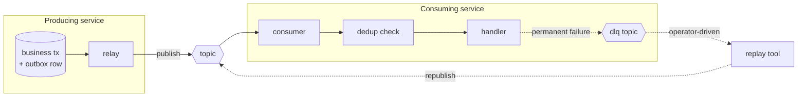

# 00 — Overview

> Status: design context, not a specification. Nothing here has been
> implemented, and no design decision is left open — see `06-decisions.md`.
> Research current as of **2026-09-05**. Version-dependent claims are dated where
> they appear; see `01-prior-art.md` for the sources behind them.

## What this is

`kafka-reliability` is a Python library for the three reliability problems that
every Kafka-based service eventually hits, and that every team ends up
re-implementing badly:

1. **Getting an event out of a database transaction and into Kafka** without
   losing it and without publishing events for transactions that rolled back.
2. **Surviving redelivery** — Kafka gives at-least-once delivery to a consumer
   group in almost every realistic configuration, so the consumer must be able
   to recognise work it has already done.
3. **Getting messages out of a dead-letter topic and back into the pipeline**
   after the bug is fixed, without replaying a million messages by accident.

These are not novel patterns. They are documented, named, and well understood —
transactional outbox, idempotent consumer, DLQ replay. What does not exist in
the Python ecosystem is a small, framework-agnostic library that implements all
three, is honest about the guarantees it provides, and can be adopted one module
at a time. That gap is the reason for this library. Section 01 argues that case
in detail, including the cases where the honest answer is "use something else".

## Who it is for

The target user is a team running Python services (FastAPI, Litestar, Django,
Celery workers, plain asyncio consumers) against Postgres and Kafka, at a scale
where correctness matters but a dedicated streaming platform team does not
exist. Concretely, the assumed situation is:

- Postgres is the system of record. Kafka is how other services learn about
  changes.
- Kafka Connect and Debezium are *available in principle* but running a Connect
  cluster is a real operational cost the team would rather not pay for a handful
  of topics.
- Throughput is in the hundreds-to-low-thousands of events per second per
  service, not hundreds of thousands. This matters: it makes a polling relay a
  legitimate design choice rather than a compromise (see `02-outbox.md`).
- The team wants to reason about delivery semantics explicitly rather than hope.

If you are running a Connect cluster already, or your event volume makes
poll-based relay untenable, the outbox module is the wrong tool and the docs
should say so rather than sell it. It is still reasonable to use the idempotent
consumer and replay modules on their own — that independence is a hard
requirement, not a nice-to-have (see `05-architecture.md`).

## The three problems

### Dual write

A service handles a request, writes a row to Postgres, and publishes an event to
Kafka. These are two systems with two independent commit paths, and there is no
ordering of them that is safe:

```mermaid
sequenceDiagram
    participant App
    participant PG as Postgres
    participant K as Kafka
    App->>PG: INSERT order; COMMIT
    Note over App,K: process dies here
    App--xK: publish OrderCreated (never happens)
    Note right of K: DB has the order,<br/>the world never hears about it
```

Publishing first is worse, not better: the transaction may roll back after the
event is already on the topic, and consumers act on an order that does not
exist. Wrapping the publish in the transaction does not help either — Kafka is
not a participant in the Postgres transaction, and a two-phase commit across the
two is not something anyone wants to operate.

The transactional outbox pattern sidesteps this by making the event durable in
the *same* transaction as the business write, and moving the Kafka publish to a
separate process that can retry indefinitely. The trade-off is explicit and
permanent: you convert a correctness problem (lost or phantom events) into a
latency and duplicate-delivery problem (events appear on the topic milliseconds
to seconds later, and may appear more than once). `02-outbox.md` covers the
mechanics.

### Redelivery

Kafka's consumer group protocol commits offsets separately from the work the
consumer does. Whatever order you choose, a crash in the wrong place either
loses a message or reprocesses one, and "reprocess" is the only choice that is
safe by default. Rebalances make this routine rather than exotic: a partition
moves to another consumer, and any message processed-but-not-committed by the
previous owner is delivered again. KIP-848 (GA in Kafka 4.0) makes rebalances
faster and incremental, which reduces how often this happens; it does not
eliminate it.

So a consumer must be idempotent. For some handlers that is free — an upsert
keyed on a business ID is naturally idempotent. For handlers with side effects
that are not (charging a card, sending an email, incrementing a counter,
publishing a downstream event) it is not free, and the standard answer is an
explicit deduplication store: derive a key from the message, record it, and skip
messages whose key you have already recorded. `03-idempotent-consumer.md` covers
key derivation, the storage trade-offs, and the several ways this pattern is
subtly wrong when implemented casually.

### Dead letters and replay

A message that a consumer cannot process must not block the partition forever.
The usual answer is to route it to a dead-letter topic and move on. That decision
is easy; the hard part is everything after it. A DLQ nobody drains is a
data-loss mechanism with extra steps. Draining it means reprocessing messages —
potentially thousands, potentially months old, potentially against a consumer
whose side effects are not idempotent — and doing so without a dry run, without
filters, and without rate limits is how a replay becomes an incident.

The replay module is operational tooling, not a runtime component:
select messages from a DLQ (or any topic) by offset range, timestamp range, or
predicate; show what would happen; then republish to a target topic under
explicit safety rails. `04-replay-dlq.md` covers it.

## How the three fit together

They compose but do not depend on each other:



The outbox produces at-least-once, so the consumer needs deduplication. Replay
deliberately re-injects messages, so the consumer needs deduplication *and* the
replay tool needs a way to say "this is a replay, dedup should/should not
suppress it" — that interaction is resolved by a replay-ID header and a
`replay_policy` on the dedup layer, described in `04-replay-dlq.md` and
`03-idempotent-consumer.md`.

## Where it runs

The library aims to be usable in essentially any Python-on-Postgres project
rather than in one framework's ecosystem. Concretely (full rationale in
`06-decisions.md` D13):

- **Outbox writers:** asyncpg, psycopg 3 (sync and async), SQLAlchemy Core/ORM
  (sync and async), Django ORM. Each is a separately typed class, because a
  wrongly-typed connection silently breaks the atomicity the pattern exists for.
- **Dedup stores:** Postgres (the only one supporting the strong
  same-transaction mode), Redis, SQLite, in-memory-for-tests.
- **Producers:** aiokafka, confluent-kafka, an in-memory double, or any object
  satisfying a three-method `Producer` protocol — which is how a FastStream
  publisher works here without the library knowing FastStream exists.
- **Consumer side:** a context manager plus CI-tested integration recipes for
  aiokafka, confluent-kafka, FastStream and Celery.

Sync and async are both first-class on the two paths that sit in the caller's
hot code — the outbox writer and the dedup store — because Django and Celery
users cannot be told to run an event loop to insert a row.

## Explicitly out of scope

This list exists so that the implementation does not drift. Each item is a thing
a reasonable person might expect the library to do, and it will not.

**Not a Kafka client.** The library sits on top of `aiokafka` or
`confluent-kafka`; it does not implement the protocol, manage connections
opinionatedly, or wrap every client option. Anything the client already exposes
well stays the client's job.

**Not a consumer framework.** No decorator-based routing, no dependency
injection, no AsyncAPI generation, no schema registry integration, no
serialization opinions beyond `bytes`. FastStream does that and does it well;
competing with it would be a mistake. This library should be usable *from*
FastStream, from a hand-written consumer loop, or from a Celery task.

**Not exactly-once processing.** Kafka's transactional producer plus
read-process-write within a single Kafka cluster gives you exactly-once *within
Kafka*. That does not extend to a Postgres write or an HTTP call, which is what
the outbox and dedup modules exist for. The library targets **at-least-once
delivery with effectively-once processing** and will say so everywhere. Any doc
or docstring that says "exactly once" without qualification is a bug.

**Not CDC.** The library will not read the Postgres WAL, will not manage
replication slots, and will not attempt to be a Debezium replacement. Polling
relay only. `02-outbox.md` explains what that costs; the mitigation is that the
outbox table uses Debezium-compatible column names, so a team that outgrows the
polling relay switches to Debezium with a connector config rather than a data
migration (`06-decisions.md` D1).

**Not an ORM integration layer.** The outbox needs to enlist in *your*
transaction. It will accept a connection or session you already have, and it
supports asyncpg, psycopg, SQLAlchemy and Django, but it will not own
your session lifecycle, provide a Django app, or ship Alembic migrations that
run themselves. It will emit DDL you can paste into your own migration.

**Not a scheduler, saga engine, or workflow engine.** No delayed messages, no
retry-with-backoff topics as a managed topology (the *pattern* is documented in
`04-replay-dlq.md`; the library does not run it for you), no compensating
transactions, no process managers.

**Not multi-broker.** Kafka only. The patterns generalise to RabbitMQ, NATS and
SQS, and generalising them is exactly how a small library becomes a leaky
abstraction. Kafka's partitioning and offset model shape too much of the design
here to pretend otherwise.

**Not multi-database for the outbox.** Postgres only, because `SKIP LOCKED`,
transactional DDL and identity semantics are load-bearing. The *dedup* store is
pluggable across four backends because that abstraction is narrow enough to hold
(D5, D13). MySQL for the outbox is declined: the port is not mechanical and the
audience does not justify it.

**Not observability infrastructure.** The library reports through a small
`MetricsSink` protocol you wire to whatever you run, with an optional
OpenTelemetry adapter behind an extra (D11). It does not ship a dashboard, a
Prometheus exporter, or a logging framework.

## What "done" means for these docs

These documents are the input to an implementation, not a substitute for it.
They are complete when a competent Python engineer who has never used the outbox
pattern could read them, understand what each module must guarantee and what it
must refuse to guarantee, and start writing code without having to make a design
decision along the way. Every decision is made; `06-decisions.md` records each
one with the trade-off accepted, the alternatives rejected, and the evidence
that would overturn it.
