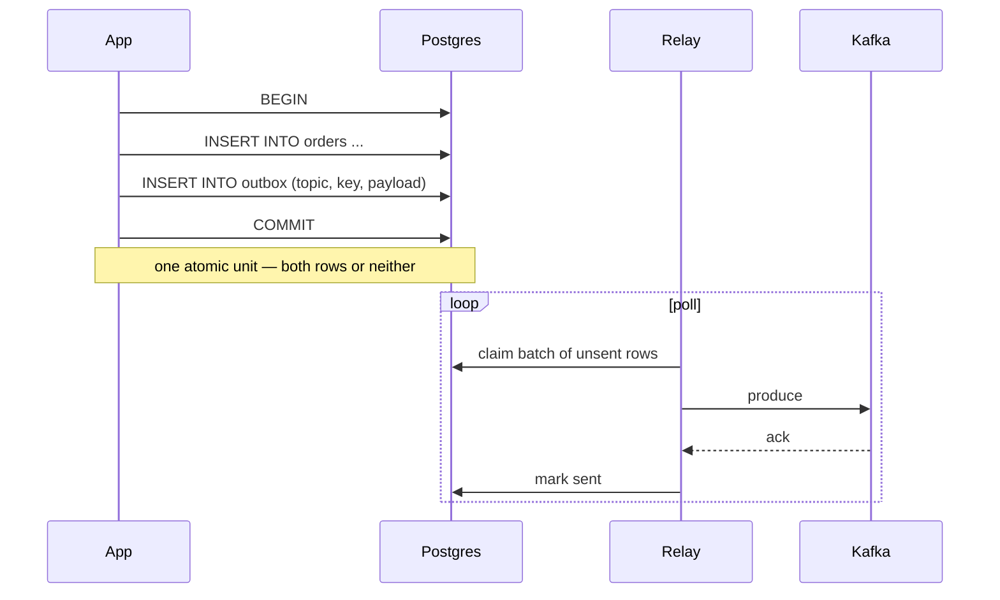

# 02 — Transactional outbox

> Design context. No implementation exists. Every decision below states its
> trade-off; decisions still genuinely open are cross-referenced to
> `06-open-questions.md` rather than pretended settled here.

## The mechanic

The dual-write problem (`00-overview.md`) exists because Postgres and Kafka
commit independently. The outbox pattern removes the second commit from the
request path entirely:



Everything interesting follows from one observation: **the relay's Kafka
acknowledgement and its "mark sent" write are themselves a dual write.** The
pattern does not eliminate the problem, it moves it to a place where the
failure mode is duplicate delivery rather than lost or phantom events. That is
the whole trade, and it is worth stating in the library's own docstrings:
*the outbox converts a correctness problem into a duplicates problem.*

## Delivery semantics

**At-least-once. Never exactly-once. Never claim otherwise.**

The relay crashes after Kafka acks and before the row is marked sent; on
restart it publishes the row again. There is no way to close this window
without a distributed transaction between Postgres and Kafka, and the two
partial answers both have costs:

- *Kafka transactional producer + storing the relay's position in Kafka.*
  Removes duplicates only if the source of truth for "what has been sent" moves
  into Kafka, which the outbox table is not. Doesn't apply cleanly.
- *Producer idempotence (`enable.idempotence=true`).* Deduplicates the
  **client's own retries** within a producer session. It does not deduplicate a
  fresh publish of the same row after a relay restart, because that is a new
  produce call with a new sequence number. Worth enabling anyway — it is nearly
  free and removes one class of duplicate — but it must not be sold as solving
  this.

**Decision: at-least-once, documented loudly, with `03-idempotent-consumer.md`
as the mandatory other half.** The trade-off is that every consumer of an
outbox-published topic inherits a deduplication obligation. The alternative —
attempting effectively-once at the relay via a distributed transaction — costs
more operational complexity than the duplicates cost the consumer, for a
guarantee that still fails under enough partitions.

Enabling producer idempotence and `acks=all` is a **default**, not an option:
without `acks=all` the relay can mark a row sent that a leader election then
loses, converting the safe failure (duplicate) into the unsafe one (loss).

## Failure modes, enumerated

Being explicit about these is the point of the document; each one should have a
test.

**Relay dies between produce-ack and mark-sent.** Duplicate on redelivery.
Accepted, per above.

**Relay dies mid-batch.** If rows are claimed as a batch and marked sent as a
batch, the whole batch republishes. Smaller batches reduce the duplicate blast
radius and increase per-row overhead. Marking each row sent individually
minimises duplicates and maximises write amplification. **Decision: batch claim,
per-row or small-chunk mark-sent, batch size configurable, default modest (~100).**

**Two relays run at once.** Inevitable during a rolling deploy, and the common
naive implementation (`SELECT ... WHERE sent_at IS NULL ORDER BY id LIMIT n`)
publishes everything twice *and* interleaves the two publishers, destroying
ordering. Must be prevented structurally, not by convention — see *Concurrency
and ordering* below.

**Kafka unavailable for an extended period.** The outbox table grows. Unbounded
growth in the primary database is a real operational hazard, so the relay must
export a backlog metric (`oldest unsent row age`, `unsent row count`) and the
docs must recommend alerting on it. The library should not silently drop rows
under backlog pressure — that is data loss dressed as resilience.

**A single row can never be published.** Payload exceeds `max.message.bytes`,
the topic does not exist and auto-creation is off, or the payload fails
serialization. A poison row at the head of an ordered stream blocks every row
behind it. Options: block forever (safe, loud, wakes someone up), skip and mark
`failed` (keeps the stream moving, silently violates ordering and drops an
event), or move to a relay-side dead letter (a `failed` state plus an error
column, alerting, no automatic skip of subsequent rows in the same key).
**Decision: block the affected ordering unit, mark the row `failed` with the
error, emit a metric, and continue other ordering units.** The trade-off is that
a single bad row halts one key's stream until an operator intervenes; the
alternative silently reorders or loses events, which is worse in a system whose
entire premise is not losing events.

**Long-running transaction holds rows invisible.** Rows are only visible to the
relay after their transaction commits, which is correct and is in fact the
property that makes the pattern work. But it means a slow transaction delays
those events, and — more subtly — **a row inserted earlier can become visible
later than a row inserted afterwards**, because sequence values are allocated
before commit. This breaks any relay that tracks a high-water mark by `id` and
never revisits lower ids: it will skip rows that committed late. See *Ordering*.

**Clock skew.** Any relay logic that orders or filters by `created_at` on
application-generated timestamps is wrong across multiple app instances. Use
database-side ordering only.

## Concurrency and ordering

Kafka guarantees ordering per partition, and the partition is chosen by the
message key. So the strongest ordering the outbox can usefully provide is
**per-key, matching what Kafka itself provides**; global total ordering across a
topic is neither achievable nor desirable.

Two mechanisms, with different characters:

### Claim-based (`FOR UPDATE SKIP LOCKED`)

```sql
SELECT * FROM outbox
 WHERE status = 'pending'
 ORDER BY id
 LIMIT :batch
 FOR UPDATE SKIP LOCKED;
```

Each worker locks its batch; concurrent workers skip locked rows and take the
next ones. This is the standard Postgres queue idiom and it scales horizontally
cleanly.

**It does not preserve per-key ordering.** Worker A takes rows 1–100 (containing
key `order-7` at row 5), worker B takes 101–200 (containing `order-7` at row
150), and B may publish first. For a topic where per-key order matters — and for
event-sourced aggregates it almost always does — this is a correctness bug that
appears only under concurrency and load, which is to say in production.

The fix is to shard the claim by key rather than by row: `WHERE hashtext(key) %
:shards = :shard`, or claim with `SKIP LOCKED` but take *all* pending rows for
each claimed key. Both work; both add complexity.

### Single-relay with a sequence cursor

One relay process (elected via a Postgres advisory lock, so a second instance
starting during a deploy simply waits) walks rows in `id` order and tracks a
cursor. Ordering is trivially correct. Throughput is one process.

The subtlety noted above bites here: **you cannot advance the cursor past ids
whose transactions have not yet committed.** Sequence values are allocated at
`INSERT`, commit order is not insertion order, and so id 105 may become visible
before id 104. A cursor that jumps to 105 loses 104 permanently. Guards:

- Ignore rows newer than some safety margin (fragile; a long transaction beats
  any margin you pick).
- Consult `pg_snapshot_xmin(pg_current_snapshot())` and only advance past rows
  whose `xmin` is below the oldest in-flight transaction. Correct, and the
  reason Debezium-style WAL reading does not have this problem at all.
- Don't use a cursor: keep a `status` column and always query for `pending`,
  which is naturally immune because a late-committing row simply shows up as
  pending later. Costs an index scan of pending rows rather than a range scan,
  which at this library's target scale is fine.

**Decision: default to `status`-column claiming with an advisory-lock-elected
single relay, offering key-sharded `SKIP LOCKED` as an opt-in for throughput.**
Trade-off: the default caps throughput at one process's produce rate (still
thousands/sec, since produces are pipelined and acks are batched) in exchange
for ordering that is correct without the user having to reason about it. Users
who need more throughput opt into sharding and accept that ordering holds
per-key only within a shard — which is the same guarantee, provided the shard
function is on the key. This is worth stating as a rule: **shard by key hash,
never by row id.**

## Polling versus CDC

The two ways to get rows out of the table:

| | Polling relay | CDC (Debezium / logical replication) |
|---|---|---|
| Latency | poll interval (10–100 ms realistic) | sub-millisecond after commit |
| Load on primary | repeated queries; index-covered but nonzero | WAL read, no query load |
| Ordering | must be engineered (above) | commit order, free |
| Late-commit hazard | real, must be handled | none — WAL is commit-ordered |
| Ops cost | none beyond the app process | replication slot + Connect cluster or a decoding client |
| Failure mode | backlog in a table | **a stalled slot pins WAL and can fill the disk** |
| Delete strategy | relay marks/deletes rows | rows can be deleted immediately (see below) |

**Decision: polling only, for v1.** Reasoning: the entire adoption case for this
library over Debezium is "you do not have to run anything else"
(`01-prior-art.md`). Shipping a CDC relay means either depending on a Connect
cluster (in which case use Debezium's own SMT, which is better) or writing a
Python logical-decoding client that manages replication slots — and a mismanaged
slot filling the primary's disk is a far worse incident than a polling delay.

The trade-off, stated plainly: users pay poll-interval latency and a small
constant query load on the primary, and the implementation must handle
late-commit ordering itself.

One CDC trick worth borrowing conceptually: with WAL-based capture, the outbox
row can be **inserted and deleted in the same transaction** — the WAL still
carries the insert, so the table stays permanently empty. It is a lovely trick
and it is unavailable to a poller, which needs the row to actually exist. Noting
it because someone will ask.

## Table schema

Two shapes, and the choice is not obvious.

### Option A — one shared `outbox` table

```sql
CREATE TABLE outbox (
    id           BIGSERIAL PRIMARY KEY,
    topic        TEXT        NOT NULL,
    key          BYTEA,
    payload      BYTEA       NOT NULL,
    headers      JSONB       NOT NULL DEFAULT '{}',
    status       TEXT        NOT NULL DEFAULT 'pending',
    created_at   TIMESTAMPTZ NOT NULL DEFAULT now(),
    published_at TIMESTAMPTZ,
    attempts     INT         NOT NULL DEFAULT 0,
    last_error   TEXT
);
CREATE INDEX outbox_pending_idx ON outbox (id) WHERE status = 'pending';
```

The partial index is the important part: it stays small regardless of table
size, so claim queries do not degrade as history accumulates.

### Option B — per-aggregate tables

`order_outbox`, `payment_outbox`, etc. Better lock locality, per-stream
retention, and a natural sharding boundary. Costs a relay (or a relay
configuration) per table and a migration per new aggregate.

**Decision: one table by default, with the table name injectable so per-aggregate
tables are achievable by running multiple relays.** Trade-off: a single table is
a hotspot at the tail (every insert hits the same index page), which at target
scale is fine and at high scale is not. Users who outgrow it can partition or
split without the library changing.

Column choices worth defending:

- **`payload BYTEA`, not `JSONB`.** The library must not own serialization. Avro
  and Protobuf payloads are not JSON, and round-tripping JSON through Postgres
  reorders keys and mangles numeric precision — fatal if a downstream consumer
  verifies a signature or hash over the bytes. Trade-off: you lose the ability
  to query payloads in SQL, which is genuinely useful when debugging. A
  `payload_json` generated column is available to users who want both and accept
  the storage.
- **`key BYTEA` nullable.** It is the Kafka partition key; null means
  round-robin, which is the correct behaviour and also the signal that this row
  has no ordering requirement.
- **`headers JSONB`.** Kafka headers are `bytes -> bytes`; JSONB imposes text
  keys and values. Accepted deliberately: it makes tracing metadata (`traceparent`,
  event type, schema id) readable in SQL, and binary header values are rare. Users
  needing binary headers can base64. *This one is arguable; see
  `06-open-questions.md`.*
- **`status TEXT` over a boolean or a nullable `published_at`.** Needs at least
  `pending` / `published` / `failed`; a boolean cannot express `failed`. Trade-off
  is a wider column and the need for a `CHECK` constraint.
- **`attempts` and `last_error`.** Without them, a row failing repeatedly for a
  structural reason is invisible.
- **No `partition` column.** Letting the producer pick the partition from the key
  is correct; pinning partitions in the outbox freezes a topic's partition count
  into historical data.

## Cleanup

Published rows are dead weight; the table must not grow forever. Options:

**Delete on publish.** Simplest, smallest table. Loses the audit trail
completely and produces heavy churn — every row is an insert plus a delete, and
the resulting dead tuples make autovacuum a permanent background cost.

**Mark published, delete later in batches.** Keeps a short audit window,
amortises vacuum pressure, needs a second background job. Deletes must be
chunked (`DELETE ... WHERE id IN (SELECT id ... LIMIT 10000)`) because a single
unbounded `DELETE` on a large table takes a long lock and generates enormous WAL.

**Partition by time, drop old partitions.** `DROP TABLE` on a partition is
metadata-only: no dead tuples, no vacuum, no long lock. Clearly the best
mechanism at scale, and clearly heavier to set up — declarative partitioning,
a partition-creation job, and a migration story users must own.

**Decision: mark published + a chunked retention sweep, default retention 7 days,
sweep offered as a library-provided coroutine/command the user schedules.**
Partitioned DDL is documented as a recommended upgrade path, not automated —
the library emitting and managing partitions crosses the line into owning the
user's schema, which `00-overview.md` rules out. Trade-off: users at high volume
must do partitioning themselves, and the docs must warn about autovacuum
tuning on a high-churn outbox table (`autovacuum_vacuum_scale_factor` near zero
with an absolute threshold is the usual advice — *unverified as a specific
recommendation for this workload; benchmark before publishing a number*).

## What the API must guarantee

Stated as obligations for `05-architecture.md` to satisfy:

1. Enqueuing an event **must** use the caller's existing transaction. If the
   library opens its own connection, the pattern is broken and the library is
   worse than useless — it is a dual write that looks safe.
2. Enqueuing must be cheap and synchronous with respect to that transaction: one
   `INSERT`, no network calls, no Kafka client touched on the write path.
3. The relay must be runnable both as a long-lived process and as a single
   bounded pass (for tests, and for users who want to drive it from their own
   scheduler).
4. Nothing on the write path may import a Kafka client. A service that only
   produces should be able to depend on the outbox write API without
   `aiokafka` or `librdkafka` installed. This is a packaging constraint, and it
   is checkable in CI.
