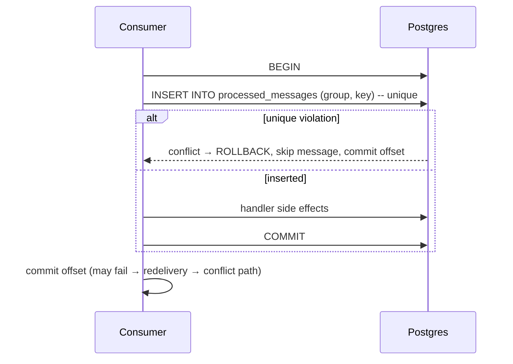

# 03 — Idempotent consumer

> Design context. Every decision states its trade-off. Nothing is left open;
> `06-decisions.md` records the cross-cutting ones with their rejected
> alternatives.

## Why this module exists

Kafka delivers at-least-once to a consumer group under every configuration a
sane person runs. The outbox (`02-outbox.md`) adds duplicates of its own. Replay
(`04-replay-dlq.md`) creates them deliberately. So the consumer must be able to
answer one question: *have I already done the work for this message?*

The naming here matters and the industry is sloppy about it. **This module does
not make a consumer idempotent.** It provides a deduplication store and the
control flow around it, which turns an at-least-once delivery stream into
effectively-once *processing* — provided the handler's side effects and the
dedup record commit together, or the handler is genuinely idempotent on its own.
If those conditions do not hold, the module narrows the window and nothing more.
Saying that clearly is more useful than a guarantee the library cannot keep.

The truly idempotent handler — an upsert keyed on a business ID, a `SET` of an
absolute value, an operation with a natural conditional (`UPDATE ... WHERE
version = :expected`) — needs none of this. The first thing the docs should say
is: **if you can make the handler naturally idempotent, do that instead.** A
dedup store is a stateful dependency on the hot path of every message; it is the
answer for handlers whose effects cannot be made conditional (charge a card,
send an email, call a non-idempotent third-party API, publish a downstream
event, increment a counter).

## Key derivation

The dedup key defines what "the same message" means. Getting it wrong is the
main failure mode of this pattern, in both directions: too broad and you
silently drop legitimate distinct work; too narrow and you deduplicate nothing.

Four candidates, in descending order of preference:

**1. A business/event identifier carried in the payload or headers.** An
`event_id` UUID minted by the producer at the moment the event was created,
ideally the outbox row's own identity. This is the only key that survives
republishing to a different topic, a partition-count change, or a replay — all
of which change offsets. If the producer uses this library's outbox, the library
can mint and carry this ID automatically, and that integration is one of the
better reasons for the three modules to live together.

**2. A deterministic hash of the payload bytes.** Works without producer
cooperation. Two genuinely distinct events with identical payloads (the same
user clicking "like" twice, two identical sensor readings) collapse into one,
which is a silent, unfalsifiable data loss. Acceptable only when the payload
provably contains something unique.

**3. `(topic, partition, offset)`.** Exactly identifies a physical record and is
always available. But it does **not** identify the *event*: the same event
republished by a relay retry lands at a different offset and passes the dedup
check unnoticed — which is precisely the duplicate class the outbox produces. It
also makes replay impossible to deduplicate, since replayed messages have new
offsets by definition. Use it as a fallback, understanding it only suppresses
consumer-side redelivery (rebalances, offset-commit failures) and not
producer-side duplication.

**4. Kafka's message key.** Almost always wrong: it is the partition key, and
many events legitimately share it. Mentioned only to rule it out.

**Decision: require an explicit key function, `Callable[[Message], str]`, with
no default.** The trade-off is friction — every user must make a decision before
their first message is processed. That is intentional. A default of "offset"
would be silently wrong for the most common case (outbox duplicates), and a
default of "payload hash" would silently drop data. Ship named helpers
(`from_header("event-id")`, `from_json_path("$.event_id")`,
`topic_partition_offset()`) so the friction is one line, not an essay.

The key should be **namespaced by consumer group**, not global. Two services
consuming the same topic must both process every message; a shared namespace
means whichever consumes first suppresses the other. Store the namespace
explicitly (`(consumer_group, key)` as the primary key) rather than relying on
separate deployments to use separate stores.

## Control flow, and the window that cannot be closed

The obvious implementation is wrong in an interesting way:

```
if store.seen(key):  return
handler(msg)
store.record(key)
```

A crash between `handler` and `record` reprocesses. A concurrent duplicate — two
consumers after a rebalance, both holding the same message — passes `seen`
simultaneously and both run the handler. The check-then-act is not atomic.

Three real designs:

### A. Same-transaction dedup (the strong one)

If the handler's side effects are writes to the same Postgres database as the
dedup store, insert the dedup row **inside the handler's transaction**:



This is genuinely effectively-once, because the dedup record and the work share
a commit. It requires the handler to be database-bound and to use the connection
the library hands it. **This is the recommended mode and the docs should push
users toward it.**

### B. Claim-then-confirm (for non-transactional side effects)

Insert the key in a `in_progress` state (unique constraint makes the claim
atomic and gives concurrent duplicates a conflict), run the handler, then mark
`done`. A crash mid-handler leaves an `in_progress` row that must eventually
expire — otherwise a message that genuinely needs reprocessing is blocked
forever.

The unavoidable ambiguity: an `in_progress` row whose lease has expired means
either "the worker died before the side effect" (must reprocess) or "the worker
died after the side effect but before confirming" (must not). No amount of
bookkeeping resolves it locally, because the side effect is in another system.
**Decision: on lease expiry, reprocess** — at-least-once is the safe direction —
**and emit a distinct metric and log so it is visible.** Trade-off: a real
duplicate side effect is possible in this narrow case, and users whose side
effect is a payment must combine this with an idempotency key at the payment
provider, which is the correct answer anyway.

### C. Record-after (fast and weak)

Handler first, record after. Cheapest, and correct only for handlers that are
already idempotent — in which case you did not need this module. Offer it, name
it honestly (`RecordAfter`), document it as a latency optimisation and not a
guarantee.

**Decision: support A and B; expose C but never default to it.** Default to A
when a database session is supplied, B otherwise.

## Storage: Postgres versus Redis

The sharpest trade-off in this module. Both ship behind one interface, along
with SQLite (single-node deployments and container-free tests) and an in-memory
store (unit tests only — it does not survive a restart, so it silently provides
no guarantee across the one event that most needs one). **Postgres is the
default** (`06-decisions.md` D5); the reasoning is below.

**Postgres**

- The decisive advantage: **it can share a transaction with the handler**
  (design A above). Nothing else on this list can.
- Durable by default, survives restarts, backed up with everything else.
- Costs: the dedup table is an insert hotspot — every message is a write, so a
  10k msg/s consumer is 10k inserts/s of pure overhead on top of the real work.
  Expiry needs a sweep job, and high-churn insert/delete tables are exactly what
  makes autovacuum expensive.
- Schema roughly:

```sql
CREATE TABLE processed_messages (
    consumer_group TEXT        NOT NULL,
    dedup_key      TEXT        NOT NULL,
    state          TEXT        NOT NULL DEFAULT 'done',
    processed_at   TIMESTAMPTZ NOT NULL DEFAULT now(),
    expires_at     TIMESTAMPTZ NOT NULL,
    PRIMARY KEY (consumer_group, dedup_key)
);
CREATE INDEX processed_messages_expiry_idx ON processed_messages (expires_at);
```

The primary key *is* the concurrency control. `INSERT ... ON CONFLICT DO NOTHING`
returning zero rows is the "already seen" signal, atomic without any explicit
locking.

**Redis**

- `SET key value NX EX ttl` is a single atomic round trip, and TTL expiry is
  automatic — no sweep job, no vacuum pressure.
- Much higher throughput, and it keeps dedup load off the primary database.
- Costs, and they are not small:
  - **Cannot share the handler's transaction.** Only designs B and C are
    available, so the strong guarantee is off the table.
  - **Availability becomes a correctness question.** If Redis is down, do you
    stop consuming (availability loss) or process without dedup (duplicate side
    effects)? There is no third option and the library must make the user choose
    explicitly rather than pick a default. **Decision: `fail_closed` (stop
    consuming) is the default**, because a library whose safety property silently
    disappears under load is worse than one that stops.
  - **Durability is configurable and frequently misconfigured.** Default Redis
    persistence can lose the last seconds of writes on a crash; a failover to a
    replica can lose more. Dedup keys lost means duplicates processed. Whether
    this matters depends entirely on what the handler does — for a
    "don't send the email twice" store it is probably tolerable, for
    "don't charge the card twice" it is not.

**Decision: pluggable `DedupStore` protocol; Postgres is the documented default
and the only one that supports the strong mode; Redis is a first-class
alternative for throughput.** Trade-off is an extra abstraction layer and an
interface narrow enough that both can implement it honestly — which means the
interface must expose whether a store supports transactional participation, so
the library can refuse design A on Redis rather than silently degrading.

## TTL

Dedup records cannot be kept forever; at 10k msg/s each extra day of retention
is hundreds of gigabytes. The TTL must exceed the longest window over which a
duplicate can plausibly arrive:

- Consumer redelivery after a rebalance: seconds. KIP-848's incremental
  rebalances (Kafka 4.0+) make this shorter still.
- Outbox relay restart republishing: seconds to minutes.
- A consumer group reset or a paused consumer catching up: hours.
- **A deliberate DLQ replay: days or weeks.** This is the dominant term, and it
  is the one people forget.

**Decision: default 7 days, explicitly configurable, and the docs must state the
rule — "TTL must be longer than your maximum replay window, not your maximum
retry window".** Trade-off: 7 days of keys at high throughput is real storage;
users who never replay can cut it to hours and should. Users who replay a
30-day-old DLQ with a 7-day TTL will get their handlers re-run, which is either
what they wanted or a disaster, and is exactly why replay has its own
interaction rules (below and in `04-replay-dlq.md`).

The expiry mechanism differs by store: Redis does it natively; Postgres needs a
chunked periodic `DELETE` (`WHERE expires_at < now()`), shipped as a callable
the user schedules. `expires_at` should be *stored* rather than computed from
`processed_at + ttl` at read time, so changing the configured TTL does not
retroactively expire or resurrect existing records.

## Consumer groups and rebalances

Three interactions that a naive implementation gets wrong:

**Offset commit ordering.** Commit offsets **after** the work and the dedup
record, never before. Committing first turns every crash into silent message
loss, which no dedup store can repair. `enable.auto.commit=false` should be a
documented requirement, not a suggestion — auto-commit commits on a timer with
no relationship to whether the handler finished.

**The rebalance duplicate.** A partition moves while a message is in flight. The
old owner may still be running the handler when the new owner receives the same
message. This is a genuine concurrent duplicate, and it is why the dedup check
must be an atomic claim (unique constraint / `SET NX`) rather than a read
followed by a write. A `seen()` boolean API invites the race; the interface
should therefore be `try_claim(key) -> bool`, not `seen(key) -> bool`. That is an
API-shape consequence of a concurrency property, and it is the sort of thing
that is very hard to retrofit.

**In-flight work after partition revocation.** When a partition is revoked, work
for it should stop: finishing it and committing offsets for a partition you no
longer own is at best wasted and at worst a lost-update race with the new owner.
**Decision: the library exposes a revocation signal (an `asyncio.Event` per
assignment) and does nothing else.** It does not cancel a running handler:
interrupting a handler mid-side-effect converts a clean duplicate into a
partial write, which is strictly worse than the wasted work it would save. The
handler observes the signal at its own safe points, or ignores it and finishes.
Trade-off: work already in flight on a revoked partition still completes and is
still wasted; the new owner's claim on the same key is what actually prevents
the double side effect.

**Partition count changes** rehash keys to different partitions. Any dedup keyed
on `(topic, partition, offset)` is meaningless across such a change. Another
argument for event IDs.

## Interaction with replay

If the dedup store did its job, a replayed message is suppressed — which defeats
the entire purpose of the replay. Options:

- Replay under a **different consumer group**, so the dedup namespace differs
  and everything reprocesses. Clean and requires no special support, but it
  reprocesses *everything*, including messages that succeeded.
- Have the replay tool stamp a **replay header** and let the dedup layer honour
  a configured policy: suppress (treat as a normal duplicate), bypass (process
  regardless), or namespace (dedup within this replay run only).
- **Purge specific keys** before replaying.

**Decision: the replay tool stamps a replay ID header; the dedup middleware takes
a `replay_policy` with `suppress` as the default.** The default is the safe one —
a replay that quietly re-charges customers is the worst outcome available — and
the operator opts into bypass knowingly. Trade-off: the common case ("we fixed
the bug, now reprocess these 400 failures") requires an explicit flag, which is
friction on purpose.

## What the module must not do

- Not manage the consumer loop. It provides a claim/record API and, at most, a
  thin middleware wrapper. Users on FastStream or a hand-rolled loop must both
  be able to use it.
- Not deserialize payloads. The key function takes the raw message and returns a
  string; what happens inside it is the user's business.
- Not silently degrade. If the store is unreachable, that is an error the
  consumer sees, not a `WARNING` and a shrug.
