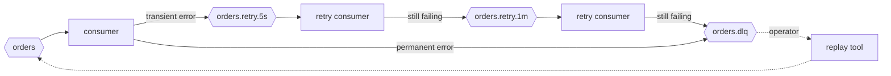

# 04 — Replay and DLQ tooling

> Design context. This module is **operational tooling**, not a runtime
> component: a Python API plus a CLI that an engineer runs deliberately, usually
> during or after an incident.
>
> **This document assumes classic consumer groups.** Share groups (production-ready
> in Kafka 4.2, February 2026) change the per-partition ownership model that much
> of the retry-topology advice below rests on. See `06-open-questions.md` Q8 —
> that interaction is unevaluated and the advice here may be dated by it.

## The problem

Routing a message that cannot be processed to a dead-letter topic is the easy
half. It unblocks the partition and it is one line of code. What follows is
where teams struggle:

- Nobody drains the DLQ, so it is a data-loss mechanism with an audit trail.
- When someone does drain it, they write a one-off script under time pressure,
  against production, at 2am, with no dry run.
- The script replays everything, including the 300 messages that were
  poison-by-payload and will fail again identically, and the 40 that a colleague
  already replayed by hand.
- Consumers re-run non-idempotent side effects, because the replay was invisible
  to the dedup layer (`03-idempotent-consumer.md`).

The module's job is to make the boring, careful version of that script the
default one.

## DLQ topologies

Three arrangements, in increasing order of operational sophistication. The
library should support all three because they are all defensible; it should have
an opinion about which to start with.

**One DLQ per source topic** — `orders` → `orders.dlq`. Simple, obvious
provenance, and the number of topics grows linearly with services. This is the
right default.

**One DLQ per consumer group** — `orders.dlq.billing-service`. Necessary when
several groups consume one topic and fail for different reasons; without it,
billing's replay re-delivers to inventory, which never had a problem. Trade-off
is more topics and a naming convention people must actually follow.

**Retry topics with escalating delay, then a terminal DLQ** — `orders.retry.5s`,
`orders.retry.1m`, `orders.retry.10m`, `orders.dlq`. Handles transient failures
(a downstream service is briefly down) without operator involvement, which is
the majority of real failures.



The cost is real and under-appreciated: retry topics **destroy ordering**. A
message that takes the 1-minute detour arrives after messages that followed it,
so for any key where order matters the retry ladder is not usable. They also
multiply topic count and make "where is my message" a genuinely hard question.

**Decision: the library ships DLQ *routing* (produce a failed message to a
configured topic with diagnostic headers) and replay. It does not run a retry
ladder for you.** The topology is documented; automating it means owning consumer
lifecycles across several topics, which `00-overview.md` puts out of scope. Note
also that Kafka Streams gained native DLQ support in 4.2 (Feb 2026) and share
groups went production-ready in the same release — share groups change the
per-partition ownership assumptions much of this advice rests on, and whether
they obsolete the retry ladder is genuinely unclear to me. Flagged as
speculative in `06-open-questions.md`.

### Distinguishing transient from permanent

The routing decision — retry versus dead-letter — cannot be made by the library,
because only the handler knows whether a `ConnectionError` to a payment gateway
is worth retrying. The library provides the classification hook (an exception
predicate, or typed exceptions the user raises); the user supplies the policy.
Trade-off: more setup than a magic default. A magic default here would be a
default guess about someone else's failure semantics.

### DLQ record shape

The replayed message must be reconstructible, and the failure must be
diagnosable without a log search. **Decision: preserve the original key, value
and headers byte-for-byte, and add namespaced diagnostic headers:**

```
x-dlq-source-topic        orders
x-dlq-source-partition    3
x-dlq-source-offset       184203
x-dlq-source-timestamp    2026-09-05T10:14:22Z
x-dlq-consumer-group      billing-service
x-dlq-error-type          ValueError
x-dlq-error-message       (truncated)
x-dlq-attempts            3
x-dlq-first-failed-at     2026-09-05T10:12:01Z
x-dlq-trace-id            (if present upstream)
```

Preserving the payload unwrapped — rather than nesting it inside a JSON envelope
with the error — is deliberate: replay becomes a byte-for-byte republish, and
the consumer needs no knowledge that a message was ever dead-lettered. The
trade-off is that headers must survive every hop, which they do in Kafka but not
through every intermediate tool, and that error text is capped by header size
limits. Full stack traces belong in logs, keyed by trace ID.

## Selecting what to replay

Replay is fundamentally *select, then act*. The selection dimensions:

**By offset range.** `--from-offset 1000 --to-offset 2000` on a partition.
Precise and exactly reproducible — the same command replays the same records
tomorrow. Requires knowing offsets, which means someone has already inspected the
topic. It is also inherently per-partition: "offset 1000" across a 12-partition
topic means twelve different points in time.

**By timestamp range.** `--from '2026-09-04T00:00Z' --to '2026-09-04T06:00Z'`.
How incidents are actually described ("everything between the bad deploy and the
rollback"), and resolves across all partitions at once via
`offsetsForTimes`/`offsets_for_times`. The caveats matter: the timestamp is the
*record's* timestamp, which is producer-set (`CreateTime`) or broker-set
(`LogAppendTime`) depending on topic config — with `CreateTime` a skewed producer
clock puts records in the wrong place. Resolution is also coarse: the broker
returns the first offset with a timestamp `>=` the target, so a partition with no
records in the window returns nothing and one with a non-monotonic timestamp
sequence can under-select.

**Decision: support both; make timestamps resolve to offsets and print the
resolved offsets before doing anything.** The operator sees `partition 3:
184100 → 184260 (160 records)` and can re-run the exact same replay by offset if
the timestamp resolution was not what they expected. Trade-off: an extra step in
the workflow, in exchange for the operator's mental model matching the machine's.

**By predicate.** A user-supplied `Callable[[Message], bool]` (Python API) or a
constrained expression over headers (CLI) — `x-dlq-error-type == 'TimeoutError'`,
`x-dlq-consumer-group == 'billing'`. This is what makes replay useful rather than
merely possible: after fixing one bug, you replay the failures caused by *that*
bug and leave the rest. Trade-off: filtering happens client-side, so the tool
reads the whole selected range regardless of how few records match. Fine at DLQ
volumes; do not extend it to replaying a high-volume primary topic without
saying so.

## Poison messages

A poison message fails deterministically regardless of when it is processed —
malformed payload, a schema the consumer will never understand, a reference to a
tenant that no longer exists. Replaying it produces the same failure and, in the
worst arrangement, an infinite loop: DLQ → replay → fail → DLQ.

Defences, all of which the tool should provide:

- **Replay-count tracking.** Increment `x-dlq-replay-count` on every replay and
  refuse (by default) to replay a message beyond a threshold. Requires the DLQ
  consumer to preserve the header when re-dead-lettering. **Decision: default
  threshold 3, overridable with an explicit flag.**
- **Loop detection.** Refuse to replay from topic X to topic X unless
  `--allow-same-topic` is passed. Replaying a DLQ into itself is almost always a
  mistake and is trivially detectable.
- **Quarantine.** `--to-topic orders.quarantine` instead of deleting. Never
  offer a delete; the tool is read-and-republish only, which makes every
  operation additive and therefore recoverable. This is the single most
  important safety property of the design: **the replay tool never destroys
  anything.** It does not delete records, does not commit offsets on the source
  topic by default, and does not modify topic configuration.

The corollary: the tool cannot un-send a replay. Once records are republished
they will be consumed. That asymmetry is exactly why dry-run is not optional.

## Dry run

**Decision: dry-run is the default; a real replay requires an explicit
`--execute`.** The trade-off is friction for the experienced operator, accepted
because the failure mode on the other side is unbounded.

Dry-run must be a genuine execution of everything except the produce call:
connect, resolve timestamps to offsets, consume the range, apply the predicate to
every record, apply poison and loop checks, and report. It must **not** be an
estimate — a dry run that says "would replay ~500" while the real run replays
50,000 because the filter behaved differently is worse than no dry run.

Report shape:

```
DRY RUN — no messages produced
source:  orders.dlq        target: orders
range:   2026-09-04T00:00Z → 2026-09-04T06:00Z
  partition 0   offsets 84100 → 84260    scanned 160   matched 12
  partition 1   offsets 91002 → 91205    scanned 203   matched 31
  partition 2   (no records in range)
filter:  x-dlq-error-type == 'TimeoutError'
skipped: 4 (replay-count >= 3)
total:   43 messages would be produced to 'orders'
oldest:  2026-09-04T00:03:11Z   newest: 2026-09-04T05:58:40Z
sample:  key=order-8812  headers={...}  value=214 bytes
run with --execute to replay
```

Two properties worth defending. Printing the **resolved offsets** makes the run
reproducible. Printing **skipped counts by reason** stops the "why did it only
replay 43 of 200" question that otherwise costs an hour.

Dry-run and execute must share one code path with a single boolean at the
produce site. Two implementations drift, and the drift is discovered during an
incident.

## Operational safety rails

Each of these exists because of a specific way replays go wrong.

- **Rate limiting** (`--rate 100/s`, on by default). Dumping 50,000 messages at
  line rate into a live topic starves real-time consumers, blows out lag, and
  can take down the downstream service the replay was meant to help. A default
  rate is the difference between a replay and a self-inflicted DoS.
- **Max messages** (`--max 1000`, with no default cap but a confirmation prompt
  above ~10,000). Bounds the blast radius of a mis-specified filter.
- **Explicit target topic.** No defaulting to the source topic's name minus
  `.dlq`, and no inference. A one-character typo in an inferred name is a
  hard-to-detect disaster; making the operator type the target means the intent
  is on the record.
- **Replay ID stamped on every record** (`x-replay-id`, a UUID per run, plus
  `x-replay-at`). This is what makes a replay traceable afterwards, and it is
  what the dedup layer keys its replay policy on (`03-idempotent-consumer.md`).
  A replay that leaves no trace is unauditable.
- **Preserve or re-derive the key?** Preserving the original key keeps
  partitioning and ordering consistent with the original stream, and is the
  default. Note it means replayed records land on the same partitions and
  therefore interleave with live traffic on those partitions — ordering relative
  to live messages is not preserved and cannot be.
- **Never commit offsets on the source DLQ by default.** Committing makes the
  replay non-repeatable and hides what was consumed; the DLQ's retention should
  be the thing that removes records. Offer `--commit` for teams who deliberately
  want a drain-once workflow, and make it loud.
- **Structured audit output** (`--audit-log path.jsonl`): one line per replayed
  record with source coordinates, target, replay ID, timestamp. This is what
  someone reads next week when asked "did that replay include order 8812".
- **Confirmation prompt on `--execute`** showing source, target, count and rate,
  suppressible with `--yes` for scripted use. Trade-off: interactive prompts are
  hostile to automation, which the `--yes` escape hatch resolves.

## Replaying to a different target

Two distinct uses, both legitimate:

- **Back to the original topic** (`orders.dlq` → `orders`). The common case
  after fixing a consumer bug. Every consumer group on the topic sees the
  replay, including groups that never had a problem — which is why per-group
  DLQs exist, and why the dedup replay policy matters.
- **To a shadow topic** (`orders.dlq` → `orders.replay-test`) consumed by a
  staging instance of the fixed consumer. Verifies the fix works before touching
  production. This should be the *documented recommended workflow*, not an
  afterthought: dry run → shadow replay → verify → real replay.

## What this module must not do

- **Not delete anything.** No record deletion, no topic deletion, no offset
  rewinding of live consumer groups. Read and republish only.
- **Not run continuously.** An always-on DLQ drainer is a retry ladder with
  worse observability, and it removes the human judgement that is the point of a
  DLQ. If a failure class is safe to retry automatically, it should not have been
  dead-lettered.
- **Not transform payloads.** Replay is republish, not migrate. A payload that
  needs fixing before it can be processed is a data-repair job with different
  review requirements. *The counter-argument — that a one-field fixup is exactly
  what an operator needs at 2am — is real; recorded in `06-open-questions.md`.*
- **Not require a UI.** Python API first, CLI on top of it, so replays can be
  scripted, reviewed in a PR, and run from CI.
