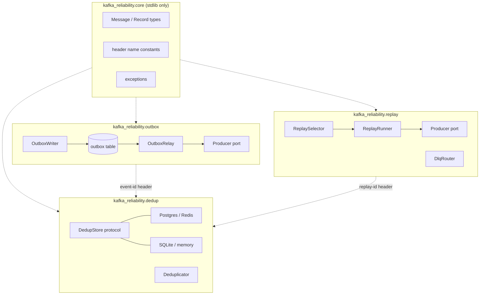

# 05 — Architecture

> Design context. The code blocks below are **signature sketches**, not an
> implementation. No bodies, deliberately. Every design choice they embody is
> decided; `06-decisions.md` carries the rationale and the rejected
> alternatives.

## The organising constraint

**Each module must be usable entirely on its own.** A team that wants only the
dedup store must not install a Postgres driver they do not use; a team that
wants only the outbox must not need a Kafka client on their web servers. This is
not tidiness — it is the adoption path. Nobody rewrites their producer and their
consumer and their runbooks in one PR, and a library that requires them to is a
library they will not adopt.

Concretely, three rules that CI can check:

1. `kafka_reliability.outbox`, `.dedup` and `.replay` never import each other.
2. Each module's third-party imports are lazy or extras-gated, so
   `pip install kafka-reliability` with no extras imports cleanly and every
   module fails with a clear message naming the missing extra.
3. The outbox *write* path imports no Kafka client at all. A test asserting
   `"aiokafka" not in sys.modules` after `from kafka_reliability.outbox import
   OutboxWriter` is cheap and catches the regression that would otherwise creep
   in via a shared `types` module.

Shared code lives in a small `core` package with no third-party dependencies
beyond the standard library. If something wants to be shared and cannot meet
that bar, it should be duplicated instead. A little duplication is cheaper than
a dependency-coupling bug that only shows up in a user's install.

## How the modules relate

They compose through data, not through imports:



The two dotted lines are the entire coupling between modules, and both are
header conventions defined in `core`:

- The outbox stamps an **event ID** header on every relayed record. If the
  consumer uses the dedup module with `key.from_header(EVENT_ID)`, outbox
  duplicates are suppressed. If it does not, nothing breaks — the header is
  ignored.
- The replay tool stamps a **replay ID** header. The dedup module's replay
  policy reads it. Same property: an unused header is inert.

Header names are constants in `core` so all three agree, but no module requires
another to be installed for its own headers to work. The concrete names are
`x-event-id`, `x-replay-id`, `x-replay-at`, and the `x-dlq-*` family (see
`core/headers.py`).

## Package layout

```
kafka_reliability/
├── core/
│   ├── message.py        # Message, Record — plain dataclasses, bytes in/out
│   ├── headers.py        # EVENT_ID, REPLAY_ID, DLQ_* constants
│   ├── clock.py          # Clock protocol; injectable for tests
│   └── errors.py         # exception hierarchy
├── outbox/
│   ├── writer.py         # enqueue into the caller's transaction
│   ├── relay.py          # poll → produce → mark sent
│   ├── schema.py         # DDL text + SQLAlchemy Table factory
│   ├── retention.py      # chunked sweep of published rows
│   └── backends/
│       ├── asyncpg.py
│       ├── psycopg.py       # sync + async
│       ├── sqlalchemy.py    # Core/ORM, sync + async
│       └── django.py        # atomic() / on_commit() aware
├── dedup/
│   ├── store.py          # DedupStore protocol, ClaimResult
│   ├── keys.py           # key-derivation helpers
│   ├── deduplicator.py   # claim/confirm control flow, replay policy
│   └── backends/
│       ├── postgres.py      # the only store supporting transactional mode
│       ├── redis.py
│       ├── sqlite.py        # single-node deployments, container-free tests
│       └── memory.py        # unit tests only; documented as no guarantee
├── replay/
│   ├── selector.py       # offset / timestamp / predicate selection
│   ├── runner.py         # dry-run + execute, one code path
│   ├── dlq.py            # DlqRouter: route a failed message + headers
│   ├── audit.py          # JSONL audit sink
│   └── cli.py            # argparse/typer entry point
├── producers/
│   ├── port.py           # the Producer protocol
│   ├── aiokafka.py
│   ├── confluent.py
│   └── memory.py         # public test double
├── metrics.py            # MetricsSink protocol; no-op default
└── contrib/
    └── otel.py           # optional OpenTelemetry MetricsSink adapter
```

`producers/` is shared by `outbox` and `replay` and is the one place a Kafka
client is imported. Both modules depend on the **protocol** in `port.py`, never
on a concrete adapter, so a user can supply their own producer (a FastStream
publisher, a test double) without the library knowing.

## Dependency boundaries

| Package | May import |
|---|---|
| `core` | stdlib only |
| `producers.port` | `core` |
| `producers.aiokafka` | `core`, `producers.port`, `aiokafka` |
| `outbox.writer` | `core` + the one DB driver its subclass targets — **no Kafka client** |
| `outbox.relay` | `core`, `producers.port`, DB driver |
| `dedup` | `core` + its chosen backend driver |
| `replay` | `core`, `producers.port`, a Kafka **consumer** |

Extras: `[outbox-asyncpg]`, `[outbox-psycopg]`, `[outbox-sqlalchemy]`,
`[outbox-django]`, `[dedup-postgres]`, `[dedup-redis]`, `[aiokafka]`,
`[confluent]`, `[otel]`, `[cli]`.
Trade-off: many extras is a documentation burden and a support-matrix burden. The
alternative — a fat install — makes the "use one module" story false, and that
story is the reason the library exists.

## Sync or async

**Decision: async-first, with sync facades for the outbox writer and the dedup
store only.** Those two sit on the caller's hot path and must match the caller's
world: Django and Celery are overwhelmingly synchronous, and telling a Celery
user to run an event loop to insert a row is absurd. The relay and the replay
runner are long-running I/O loops with no such constraint and are async only.

The trade-off is a maintained duplication of two small surfaces. It is contained
because the sync paths are *just SQL* — no Kafka, no concurrency — so they are
genuinely separate implementations rather than a `asyncio.run()` wrapper, which
would deadlock inside a running loop.

## API sketch — core

```python
# kafka_reliability/core/message.py
@dataclass(frozen=True, slots=True)
class Record:
    """A message as it exists on a topic."""
    topic: str
    partition: int
    offset: int
    key: bytes | None
    value: bytes
    headers: tuple[tuple[str, bytes], ...]
    timestamp: datetime

@dataclass(frozen=True, slots=True)
class OutgoingMessage:
    """A message to be produced."""
    topic: str
    value: bytes
    key: bytes | None = None
    headers: Mapping[str, bytes] = field(default_factory=dict)
```

```python
# kafka_reliability/producers/port.py
class Producer(Protocol):
    async def send(self, message: OutgoingMessage) -> None: ...
    async def flush(self, timeout: float | None = None) -> None: ...
```

`send` returns only once the broker has acknowledged the message, and failures
surface as `ProducerError` (D14). Deliberately two methods, no partitioner
control, no serializers, no config passthrough. Anything richer belongs to the client the user configured and
handed in.

## API sketch — outbox

```python
# kafka_reliability/outbox/writer.py  — one typed class per backend (D9)
class BaseOutboxWriter:
    """Shared row construction, header validation, event-id minting."""
    def __init__(self, *, table: str = "outbox", event_id_header: str = EVENT_ID) -> None: ...

class AsyncpgOutboxWriter(BaseOutboxWriter):
    async def enqueue(
        self,
        conn: asyncpg.Connection,        # a CONNECTION in the caller's transaction, never a pool
        *,
        topic: str,
        payload: bytes,
        aggregatetype: str,
        aggregateid: str,
        type: str,
        headers: Mapping[str, bytes] | None = None,
        event_id: uuid.UUID | None = None,
    ) -> uuid.UUID: ...

    async def enqueue_many(self, conn: asyncpg.Connection,
                           messages: Sequence[OutboxMessage]) -> list[uuid.UUID]: ...

class SqlAlchemyOutboxWriter(BaseOutboxWriter):
    async def enqueue(self, session: AsyncSession, *, topic: str, ...) -> uuid.UUID: ...

class PsycopgOutboxWriter(BaseOutboxWriter):        # async
    async def enqueue(self, conn: psycopg.AsyncConnection, *, topic: str, ...) -> uuid.UUID: ...

class SyncPsycopgOutboxWriter(BaseOutboxWriter):
    def enqueue(self, conn: psycopg.Connection, *, topic: str, ...) -> uuid.UUID: ...

class SyncSqlAlchemyOutboxWriter(BaseOutboxWriter):
    def enqueue(self, session: Session, *, topic: str, ...) -> uuid.UUID: ...

class DjangoOutboxWriter(BaseOutboxWriter):
    """Uses the current atomic() block on the named database alias."""
    def enqueue(self, *, using: str = "default", topic: str, ...) -> uuid.UUID: ...
```

Separate typed classes rather than one `conn: Any` with runtime dispatch. The
mistake this prevents is specific and severe: **passing a pool where a
connection was expected** runs the insert in its own transaction, which silently
breaks the atomicity the entire pattern exists for — and it produces no error at
all, just a rare lost or phantom event under crash. A type checker rejects it at
the call site; runtime dispatch catches it only if we remembered to look
(`06-decisions.md` D9).

`enqueue` returns the event ID because the caller often needs it before the
transaction commits — to log it, to return it in an API response, or to correlate
with the dedup header the consumer will key on.

```python
# kafka_reliability/outbox/relay.py
@dataclass(frozen=True)
class RelayConfig:
    batch_size: int = 100
    poll_interval: float = 0.1
    ordering: Literal["strict", "sharded"] = "strict"
    shard_count: int = 1
    shard_index: int = 0
    max_attempts: int = 10
    advisory_lock_key: int | None = None

class OutboxRelay:
    def __init__(self, *, pool: Any, producer: Producer, table: str = "outbox",
                 config: RelayConfig = RelayConfig()) -> None: ...

    async def run(self, *, stop: asyncio.Event | None = None) -> None: ...
    async def run_once(self) -> RelayBatchResult: ...   # one pass; for tests and external schedulers
    async def stats(self) -> OutboxStats: ...           # pending count, oldest pending age, failed count
```

```python
# kafka_reliability/outbox/schema.py
def outbox_ddl(table: str = "outbox",
               payload: Literal["bytea", "jsonb"] = "bytea") -> str: ...   # paste into your migration
def make_outbox_table(metadata: Any, table: str = "outbox") -> Any: ...    # SQLAlchemy Table
def django_migration(table: str = "outbox") -> str: ...                    # RunSQL body

# kafka_reliability/outbox/retention.py
async def sweep_published(pool: Any, *, older_than: timedelta, chunk: int = 10_000,
                          table: str = "outbox") -> int: ...
```

## API sketch — dedup

```python
# kafka_reliability/dedup/store.py
class ClaimResult(Enum):
    CLAIMED = auto()        # first time — process it
    ALREADY_DONE = auto()   # completed before — skip
    IN_PROGRESS = auto()    # another worker holds a live lease — skip, do not commit offset

class DedupStore(Protocol):
    supports_transactions: bool

    async def claim(self, group: str, key: str, *, ttl: timedelta,
                    lease: timedelta | None = None, conn: Any | None = None) -> ClaimResult: ...
    async def confirm(self, group: str, key: str, *, conn: Any | None = None) -> None: ...
    async def release(self, group: str, key: str, *, conn: Any | None = None) -> None: ...
    async def purge(self, group: str, keys: Iterable[str]) -> int: ...
```

`claim`, not `seen`. A boolean `seen()` cannot be implemented race-free, and an
API that invites the race is the wrong API (`03-idempotent-consumer.md`). The
`conn` stays `Any` here — unlike the outbox writer (D9) — because it is a
*protocol* method implemented by stores that accept different connection types,
and because passing the wrong thing degrades the guarantee rather than silently
voiding it: `supports_transactions` is checked at construction, so a store that
cannot use `conn` refuses the strong mode outright instead of ignoring the
argument. The
`None` for Redis, and `supports_transactions` lets the `Deduplicator` refuse the
strong mode rather than degrade silently.

```python
# kafka_reliability/dedup/keys.py
def from_header(name: str) -> Callable[[Record], str]: ...
def from_json_path(path: str) -> Callable[[Record], str]: ...
def topic_partition_offset() -> Callable[[Record], str]: ...
def payload_hash(algorithm: str = "sha256") -> Callable[[Record], str]: ...
```

```python
# kafka_reliability/dedup/deduplicator.py
class Deduplicator:
    def __init__(self, *, store: DedupStore, group: str,
                 key: Callable[[Record], str],          # no default, on purpose
                 ttl: timedelta = timedelta(days=7),
                 mode: Literal["transactional", "claim_confirm", "record_after"] = "transactional",
                 lease: timedelta = timedelta(minutes=5),
                 replay_policy: Literal["suppress", "bypass", "namespace"] = "suppress",
                 on_store_unavailable: Literal["fail_closed", "fail_open"] = "fail_closed") -> None: ...

    @asynccontextmanager
    async def process(self, record: Record, *, conn: Any | None = None) -> AsyncIterator[bool]: ...
```

The context manager is the whole ergonomic bet:

```python
async with dedup.process(record, conn=session) as should_process:
    if should_process:
        await handle(record, session)
```

Exiting normally confirms; an exception releases the claim so the message is
retried. It works identically inside FastStream, a raw `aiokafka` loop, or a
Celery task, because it knows nothing about any of them.

## API sketch — replay and DLQ

```python
# kafka_reliability/replay/dlq.py
class DlqRouter:
    def __init__(self, *, producer: Producer, topic: str | Callable[[Record], str],
                 consumer_group: str, include_error_message: bool = True,
                 max_error_bytes: int = 1024) -> None: ...

    async def route(self, record: Record, error: BaseException, *, attempts: int = 1) -> None: ...
```

```python
# kafka_reliability/replay/selector.py
@dataclass(frozen=True)
class Selection:
    topic: str
    from_offset: Mapping[int, int] | None = None
    to_offset: Mapping[int, int] | None = None
    from_timestamp: datetime | None = None
    to_timestamp: datetime | None = None
    partitions: Sequence[int] | None = None
    predicate: Callable[[Record], bool] | None = None
    max_messages: int | None = None

class ReplaySelector:
    def __init__(self, *, consumer_factory: Callable[[], Any]) -> None: ...
    async def resolve(self, selection: Selection) -> ResolvedSelection: ...   # timestamps → concrete offsets
```

```python
# kafka_reliability/replay/runner.py
@dataclass(frozen=True)
class ReplayPlan:
    replay_id: str
    resolved: ResolvedSelection
    target_topic: str
    matched: int
    skipped: Mapping[str, int]          # reason → count
    samples: Sequence[Record]

@dataclass(frozen=True)
class ReplayOptions:
    target_topic: str                    # required; never inferred
    rate_per_second: float | None = 100.0
    max_replay_count: int = 3
    allow_same_topic: bool = False
    preserve_key: bool = True
    commit_source_offsets: bool = False
    audit_path: Path | None = None

class ReplayRunner:
    def __init__(self, *, selector: ReplaySelector, producer: Producer,
                 options: ReplayOptions) -> None: ...

    async def dry_run(self, selection: Selection) -> ReplayPlan: ...
    async def execute(self, selection: Selection) -> ReplayResult: ...
```

`dry_run` and `execute` share one traversal with a single branch at the produce
call, so what the dry run reports is what the execution does
(`04-replay-dlq.md`).

## Testing shape

Not an implementation detail — it constrains the API:

- `run_once()` on the relay and `dry_run()` on the replay runner exist partly so
  tests never need `sleep()`. Any design requiring a test to wait for a poll
  interval is the wrong design.
- An `InMemoryProducer` implementing the `Producer` protocol ships with the
  library and is public. Users need it to test their own code.
- A `Clock` protocol in `core` so TTL and lease expiry are testable without
  freezing global time.
- Postgres and Redis behaviour is tested against real servers (testcontainers or
  docker-compose), never fakes. `SKIP LOCKED` semantics, `ON CONFLICT` behaviour
  under concurrency, and Redis `SET NX EX` atomicity are exactly the things a
  fake gets wrong — and they are the things this library's correctness rests on.

## API sketch — metrics

```python
# kafka_reliability/metrics.py
class MetricsSink(Protocol):
    def counter(self, name: str, value: int = 1, **labels: str) -> None: ...
    def gauge(self, name: str, value: float, **labels: str) -> None: ...
    def histogram(self, name: str, value: float, **labels: str) -> None: ...

class NullMetrics:      # the default
    ...

# kafka_reliability/contrib/otel.py — behind the [otel] extra
class OtelMetrics:
    def __init__(self, meter: Any) -> None: ...
```

A protocol rather than a direct OpenTelemetry dependency: users on Prometheus
write a ten-line adapter, and the library does not take a dependency that has
moved under people before (`06-decisions.md` D11, which also fixes the metric
names). The one rule the implementation must hold to is that **labels are
bounded** — never the dedup key, message key, partition or offset. Unbounded
cardinality is how a library takes down a metrics backend, and it is far easier
to introduce than to notice.

`metrics.py` holds the name constants and `METRIC_SPECS` (kind and permitted
labels per metric) as the code mirror of D11's table; emission tests check
call sites against it.

## Supported versions

**Python 3.11+.** `asyncio.TaskGroup` and `ExceptionGroup` matter in the relay,
which supervises concurrent produces and must not lose a row when one of them
fails; `Self` tidies the rest. Trade-off: 3.10 users are excluded, and the cost
of including them is hand-rolled task supervision in the one place where getting
it wrong loses messages.

**Kafka 3.5+ tested, 4.x recommended.** Nothing in the design requires a
4.x-only behaviour — established by design review, not against a live 3.5
cluster, so the CI matrix must actually test the floor rather than assume it.
What 4.x improves is documented rather than required: KIP-848's incremental
rebalances shorten the duplicate-delivery window, KIP-890 hardens transactions,
and 4.2's share groups change the DLQ topology as described in `04-replay-dlq.md`.

**Postgres 12+** for the outbox: `SKIP LOCKED` (9.5), `GENERATED ALWAYS AS
IDENTITY` (10) and `pg_current_snapshot()` (13, used only by the optional
cursor guard) set the floor, and 12 is the oldest release anyone should be
running anyway. The cursor guard degrades gracefully below 13 because the
default relay uses `status`-column claiming, which does not need it.
